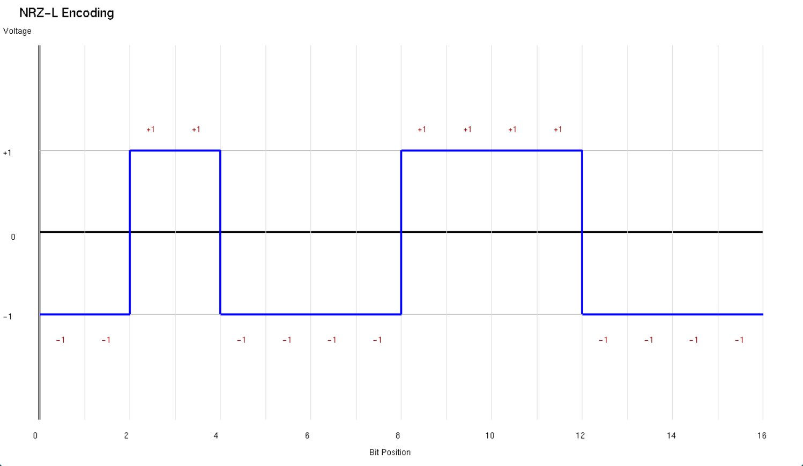

<!--
  Professional README for the `signal_generator` project.
  Generated/updated per user request: includes badges, emojis, clear sections, Windows FreeGLUT setup, compile command and examples.
-->

# 🎛️ Signal Generator

Small interactive C++ program that converts digital or analog input into common line-coded waveforms and visualizes them using OpenGL/GLUT.

  

## Features

- Line coding: NRZ-L, NRZ-I, Manchester, Differential Manchester, AMI ✅
- Scrambling for AMI: B8ZS, HDB3 ✅
- Modulation helpers: PCM (uniform quantization), Delta Modulation (DM) ✅
- Visualization: real-time waveform rendering with OpenGL/GLUT ✅
- Small analytical tools: longest palindrome (Manacher’s algorithm), longest zero sequence detection ✅

## Prerequisites

- MinGW g++ (or other C++ compiler compatible with Windows)
- FreeGLUT 3.0.0 (or compatible GLUT implementation)
- OpenGL (standard on Windows via Windows SDK)

Make sure your environment can find FreeGLUT headers and libraries when compiling.

## Installation (Windows) — FreeGLUT setup

Option A — Manual FreeGLUT installation for MinGW (preferred)

If you use a MinGW installation under `C:\MinGW` (or similar), place the FreeGLUT files into MinGW's standard folders. Example layout:

```
C:\MinGW\
├── bin\
│   └── freeglut.dll          ← DLL here (optional, can be copied to exe folder instead)
├── include\
│   └── GL\
│       ├── freeglut.h        ← Headers here
│       ├── freeglut_ext.h
│       ├── freeglut_std.h
│       └── glut.h
└── lib\
  └── libfreeglut.a         ← Static/import library here
```

Steps:
1. Download FreeGLUT binaries (or build from source) from https://freeglut.sourceforge.net/ or a binary distribution (e.g. FreeGLUT for MinGW).
2. Copy the header files into `C:\MinGW\include\GL\`.
3. Copy the library (`libfreeglut.a` or `freeglut.lib`) to `C:\MinGW\lib\`.
4. Optionally place `freeglut.dll` in `C:\MinGW\bin\` so it is available system-wide, or copy it next to your executable (recommended for portability). You can also add the DLL folder to your PATH.

Verify the setup by compiling and linking (see Compilation section). The include directive in the source uses `#include <GL/glut.h>` so the header location above will satisfy it.

Option B — MSYS2 / pacman (alternate)

If you prefer MSYS2 (recommended for an integrated toolchain), install freeglut from pacman in the MinGW64 environment:

```powershell
# In MSYS2 MinGW64 shell
pacman -Syu
pacman -S mingw-w64-x86_64-toolchain mingw-w64-x86_64-freeglut
```

Then use the MinGW-w64 `g++` from MSYS2 to compile and link.

After installation (either option), verify `#include <GL/glut.h>` resolves and the linker can find the FreeGLUT import library.

## Compilation

Use this command in PowerShell (assuming `g++` and FreeGLUT are available):

```powershell
g++ -o signal_generator.exe signal_generator.cpp -lfreeglut -lopengl32 -lglu32
```

Notes:
- If your FreeGLUT library is named differently (e.g., `-lglut`), adjust the flag.
- If headers/libs are in non-standard locations, add `-I` and `-L` flags:

```powershell
g++ -I"C:\path\to\freeglut\include" -L"C:\path\to\freeglut\lib" -o signal_generator.exe signal_generator.cpp -lfreeglut -lopengl32 -lglu32
```

## Usage Examples

Run the program from PowerShell:

```powershell
.\signal_generator.exe
```

Example interactive session (user input shown after prompts):

- Program: "1. Digital Input\n2. Analog Input (PCM/DM)\nChoice: "
- User: `1` (Digital)
- Program: "Binary data: "
- User: `0011000011110000`
- Program prints longest palindrome, then prompts for encoding:
- Program: "1. NRZ-L\n2. NRZ-I\n3. Manchester\n4. Diff Manchester\n5. AMI\nChoice: "
- User: `3` (Manchester)

Output (console):

```
=== Digital Signal Generator ===
... (prompts) ...
Longest Palindrome: 000011110000 (Length: 12)
Signal: 1 -1 -1 1 ...  (waveform sample values printed)
OpenGL window opened. Close to exit...
```

When Manchester is selected the displayed waveform sample length will be double the bit-length (mid-bit transitions are shown). Close the OpenGL window to quit the program.

signal:-
 -> PCM bits

If you choose Analog Input (PCM) and supply 4 samples `0.1 0.2 0.4 0.9` with 2 bits/sample the program will quantize into 4 levels and print a resulting bitstring like `00 01 10 11` concatenated as `00011011` (actual output depends on min/max scaling).

## Contributing

Contributions are welcome! Suggested workflow:

1. Fork the repository.
2. Create a feature branch: `git checkout -b feature/my-change`.
3. Make changes and add tests where feasible.
4. Open a Pull Request with a clear description of your change.

Please open issues for bugs or feature requests. Keep changes small and well-scoped.

## License

This project is provided under the MIT License — see `LICENSE` 

